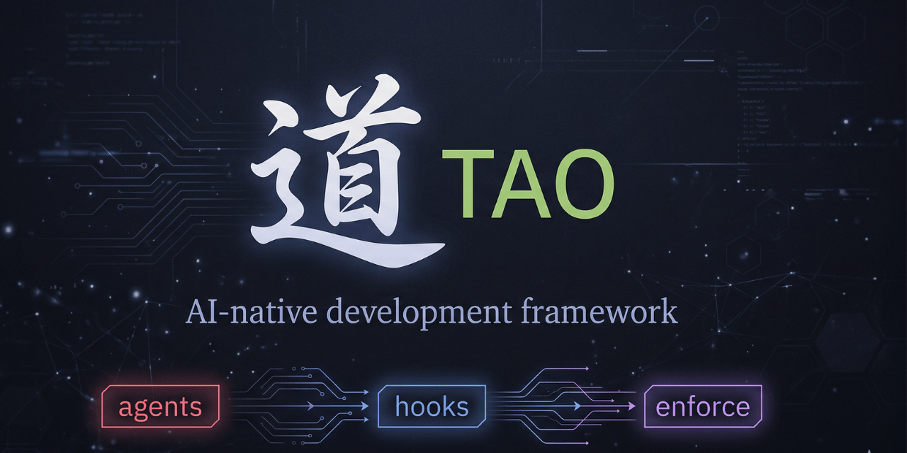

<div align="center">

# 道 TAO



**From vibe coding to engineering.**

*You say "execute". TAO picks the task, routes the right model, implements, lints, commits — and loops to the next one. No prompting. No babysitting. No chaos.*

An AI-native development framework for VS Code Copilot that replaces prompt-and-pray with a **self-running engineering pipeline** — brainstorm, plan, execute in a loop.

[](LICENSE)
[](#-bilingual)
[](https://code.visualstudio.com/)
[](https://github.com/andretauan/tao/releases/tag/v1.0.1)

[🇧🇷 Leia em Português](README.pt-br.md)

</div>

---

## Vibe Code vs TAO Code

You've seen it — or lived it. Someone opens Copilot, types "build me an app", gets a wall of code, hits accept, types another prompt, accepts again. Thirty prompts later there's a project that *kind of* works but nobody planned, nobody reviewed, and nobody can maintain.

That's **vibe coding** — building software on vibes. No structure. No plan. No quality control. Just prompts and hope.

**TAO Code is the opposite.** It's a mindset shift:

> **Don't just prompt. Think first. Plan first. Then let the machine execute — with guardrails.**

You still use AI for everything. You still write zero (or minimal) code by hand. But instead of a chaotic chain of prompts, you get:

- **A brainstorm phase** where the AI explores your problem *before* writing a single line
- **A structured plan** where every task is defined, scoped, and ordered — before any code exists
- **An autonomous execution loop** that implements each task, one by one, with lint checks, quality gates, and atomic commits
- **Real engineering artifacts** — decision logs, traceability, changelogs — not just "it compiled, ship it"

**The result is the same:** AI builds your project. **The process is completely different:** organized, traceable, professional.

You don't need to know programming to use TAO. But if you use TAO, you'll start *thinking* like an engineer — because the framework forces structure before code.

**That's the upgrade. From vibe code to TAO code.**

---

## Why TAO

### 🔄 Autonomous Loop

You say `execute`. TAO picks the task, implements, lints, commits — **and loops to the next one without stopping.** Go grab a coffee. Come back to 10 atomic commits, each traced to a planned task.

No more prompt-by-prompt babysitting. One command runs the entire phase.

### 🔒 Bulletproof Quality

Every commit passes through layered enforcement:

- **L0 — Git hooks** block violations at commit time: linting, commit message validation, branch protection, brainstorm/plan validation, ABEX security scan. These are bash scripts — deterministic, no AI involved.
- **L1 — Agent hooks** provide real-time feedback during sessions: read-before-edit enforcement (R5), dangerous command detection, auto-lint after edits, context tracking. Also deterministic bash scripts via VS Code's PostToolUse hooks.
- **L2 — Agent instructions** cover subjective criteria: model routing, ABEX 3-pass quality scoring, skill selection. These depend on agent instruction-following.

**~75% of enforcement rules are deterministic (L0 + L1)** — they run as bash scripts, not "please remember to lint." Code that doesn't pass the automated gates doesn't ship. The remaining ~25% (L2) relies on agent compliance with prompt instructions.

### 💰 60% Cost Reduction

Smart routing sends each task to the cheapest AI model that can handle it:

- Simple stuff (CRUD, forms, tests) → **Sonnet** (1x cost)
- Complex stuff (architecture, security) → **Opus** (3x cost)
- Database and git operations → **GPT-4.1** (free)

Without routing: 10 tasks × Opus = 30x cost. With TAO: 2 Opus (6x) + 6 Sonnet (6x) + 2 free (0x) = **12x cost. 60% savings.**

### 🛡️ Rate Limit Shield

GitHub Copilot blocks you when you burn through premium requests too fast — even on Pro+. TAO fights this at three levels:

1. **Prevention** — routing keeps ~60-80% of requests on cheaper/free models
2. **Fallback** — if the primary model is blocked, Execute-Tao's model chain automatically falls back to GPT-4.1 (free) and keeps running
3. **Zero-cost ops** — hooks, lint, and git operations are deterministic scripts that never consume premium requests

You stretch your monthly quota from ~2 sessions to ~4+ sessions.

---

## The Core Idea

You tell the AI **what** to build. TAO handles the **how**, **when**, and **in what order** — in a continuous loop, without stopping to ask you anything.

```
Without TAO (vibe coding):            With TAO:
──────────────────────────             ────────
prompt → wait → review                "execute"
prompt → wait → review                  ↓
prompt → wait → review                ┌──────────────────────────┐
prompt → wait → review                │ Pick task                │
prompt → wait → review                │ → Route to right model   │
prompt → wait → fix                   │ → Read context & files   │
prompt → wait → review                │ → Implement              │
prompt → wait → re-prompt             │ → Lint & validate        │
prompt → wait → hope it works         │ → Commit                 │
(you babysit 30+ prompts)             │ → Next task ←───── LOOP  │
                                      └──────────────────────────┘
                                      (you review the finished result)
```

**One command. Full phase. Every task committed individually with quality gates.**

---

## 🔄 The Loop — TAO's Engine

The execution loop is what makes TAO different from prompt templates or agent wrappers. When you say `execute`, this runs **automatically, in sequence, without pausing**:

```
 ┌─→ 1. CHECK PAUSE    Is .tao-pause present? → STOP
 │   2. READ STATUS    Parse STATUS.md → find next ⏳ task
 │   3. ROUTE          Simple task → Sonnet (1x)
 │                     Complex task → Opus via @Shen (3x)
 │                     Database → @Di (free)
 │                     Git ops → @Qi (free)
 │   4. READ & IMPLEMENT  Read required files → code → test
 │   5. QUALITY GATE   Run linter → fix if failed (up to 3 attempts)
 │   6. COMMIT         git add (specific files) → commit → push
 │   7. ADVANCE        Mark ⏳ → ✅ in STATUS.md
 └─← 8. LOOP           Back to step 1 — immediately
```

The loop runs until **every task in the phase is ✅** — or you hit the kill switch (`.tao-pause`).

**What this means in practice:** you start a phase with 10 tasks, say "execute", and come back to find 10 atomic commits, each with lint passing, each traced to a planned task. If something fails 3 times, the loop escalates to a more powerful model automatically — it never stops and never asks you to intervene.

---

## ☯️ Think → Plan → Execute

TAO structures every project into three layers. This is the core of the "TAO Code" mindset — **think before you code, plan before you build:**

**1. THINK — `@Brainstorm-Wu` (Opus)**

Before any code exists, Wu explores your problem space. It produces three documents:
- **DISCOVERY.md** — open exploration of the domain, constraints, and possibilities
- **DECISIONS.md** — structured decisions using the IBIS protocol (position → argument → counter-argument)
- **BRIEF.md** — compressed synthesis with a maturity gate (≥5 of 7 criteria required to proceed)

*Think of it as the architect's sketch before construction begins.*

**2. PLAN — `@Brainstorm-Wu` (Opus)**

From the BRIEF, Wu creates an actionable plan:
- **PLAN.md** — what to build and why, with decision traceability
- **STATUS.md** — task table with order, complexity, and executor assignment
- **Task files** — individual specs for each task (objective, files to touch, steps, acceptance criteria)

*Think of it as the blueprint — every room, every wall, every wire, defined before the first nail is hammered.*

**3. EXECUTE — `@Execute-Tao` (Sonnet)**

Tao enters the autonomous loop. It picks the first pending task, reads the relevant files, implements, runs lint, commits, and immediately moves to the next one. Complex tasks are automatically routed to @Shen (Opus). Database tasks go to @Di (free).

*Think of it as the construction crew — following the blueprint, room by room, with quality inspections at every step.*

**Why this matters:** In vibe coding, AI writes code based on your vibes — no plan, no structure, no traceability. In TAO Code, every line of code traces back to a decision that traces back to an exploration. When something breaks, you know *why* it was built that way.

---

## 🤖 The Agents

Six specialized agents, each locked to a specific AI model — no manual switching, no cost surprises:

| Agent | Model | Cost | Role |
|-------|-------|------|------|
| **@Execute-Tao** 道 | Sonnet 4.6 | 1x | **The loop.** Picks tasks, routes models, implements, lints, commits, repeats. |
| **@Brainstorm-Wu** 悟 | Opus 4.6 | 3x | Thinks and plans. Explores ideas, documents decisions, creates structured plans. |
| **@Shen** 深 | Opus 4.6 | 3x | Complex worker. Hard debugging, architecture, security. Called by Tao when needed. |
| **@Di** 地 | GPT-4.1 | free | DBA. Migrations, schema design, query optimization. |
| **@Qi** 气 | GPT-4.1 | free | Deploy. Git commit, push, merge. |

**@Investigate-Shen** is a user-invocable variant of @Shen — use it for direct investigations outside the loop.

**How they work together:** You talk to **Wu** (brainstorm & plan) and **Tao** (execute). Tao automatically calls **Shen** for hard tasks, **Di** for database work, and **Qi** for git operations. You never manually switch between agents during execution.

---

## 🚀 Quickstart

### What you need

- **VS Code** with **GitHub Copilot** (Agent Mode enabled)
- **Git** and **Python 3** (3.8+)
- macOS, Linux, or WSL2 (native Windows CMD not supported)

### Install (2 minutes)

```bash
# Clone TAO (once, anywhere)
git clone https://github.com/andretauan/tao.git ~/TAO

# Go to your project (new or existing)
cd /path/to/your-project

# Run the installer
bash ~/TAO/install.sh .
```

The installer asks 5 questions (language, project name, description, branch, lint stack) and generates everything — agents, hooks, skills, config, templates.

Then enable VS Code hooks (one-time setting):
```
Settings → search "chat.useCustomAgentHooks" → enable
```

### Your first project (3 steps)

**Step 1 — Brainstorm.** In Copilot Chat, select `@Brainstorm-Wu` and say:

> brainstorm phase 01 — I want to build [describe your project]

Wu explores the problem, documents decisions, and produces a BRIEF.

**Step 2 — Plan.** Still in `@Brainstorm-Wu`:

> plan phase 01

Wu creates PLAN.md, STATUS.md, and individual task files with full specs. Review and adjust before proceeding.

**Step 3 — Execute.** Select `@Execute-Tao` and say:

> execute

**That's it.** Tao enters the autonomous loop — picks the first task, implements, lints, commits, and moves to the next one without stopping. Come back to find atomic commits for every task, each traced to the plan.

---

## 📦 What Gets Installed

<details>
<summary>Click to expand the full file tree</summary>

```
your-project/
├── CLAUDE.md                      # Rules for all agents (project context)
├── .github/
│   ├── copilot-instructions.md    # Auto-loaded by Copilot every session
│   ├── instructions/
│   │   ├── tao.instructions.md    # TAO-specific instructions (always loaded)
│   │   ├── tao-code.instructions.md  # Auto-injected on all code files
│   │   ├── tao-test.instructions.md  # Auto-injected on test files
│   │   ├── tao-api.instructions.md   # Auto-injected on API/route files
│   │   └── tao-db.instructions.md    # Auto-injected on DB/migration files
│   ├── agents/                    # 6 agent files (3 user-facing + 3 subagents)
│   ├── hooks/
│   │   └── hooks.json             # SessionStart + PostToolUse hooks
│   ├── skills/                    # 14 TAO skills (auto-discovered by VS Code)
│   │   ├── INDEX.md               # Skill catalog — R3 bridge
│   │   ├── tao-onboarding/        # Framework guide for new users
│   │   ├── tao-plan-writing/      # Task decomposition methodology
│   │   ├── tao-brainstorm/        # IBIS brainstorm methodology
│   │   ├── tao-code-review/       # 6-axis code review
│   │   ├── tao-security-audit/    # OWASP Top 10 checklist
│   │   ├── tao-test-strategy/     # Test pyramid + coverage
│   │   ├── tao-refactoring/       # Safe refactoring protocol
│   │   ├── tao-clean-code/        # SOLID, DRY, KISS principles
│   │   ├── tao-architecture-decision/  # ADR writing + trade-off matrix
│   │   ├── tao-api-design/        # REST API conventions
│   │   ├── tao-database-design/   # Schema + migration patterns
│   │   ├── tao-git-workflow/      # Commit conventions + branch strategy
│   │   ├── tao-debug-investigation/  # Structured debugging protocol
│   │   └── tao-performance-audit/ # Profiling + optimization
│   └── tao/
│       ├── tao.config.json        # Central config (models, lint, git, paths)
│       ├── CONTEXT.md             # Active state — persists between sessions
│       ├── CHANGELOG.md           # Structured changelog
│       ├── RULES.md               # Inviolable rules reference (7 security LOCKs)
│       ├── scripts/               # Shell scripts (hooks, gates, validators)
│       └── phases/                # Phase templates (language-specific)
```

When a phase is created:

```
docs/phases/phase-01/
├── PLAN.md                        # What to build and why
├── STATUS.md                      # Task table: ⏳ pending, ✅ done, ❌ blocked
├── progress.txt                   # Session log
├── brainstorm/
│   ├── DISCOVERY.md               # Open exploration of the problem space
│   ├── DECISIONS.md               # IBIS-structured decisions
│   └── BRIEF.md                   # Compressed synthesis (≥5/7 maturity gate)
└── tasks/
    ├── 01-setup-database.md       # Full spec: objective, files, steps, criteria
    ├── 02-create-api.md
    └── ...
```

</details>

---

## 🧠 Skills Library

TAO ships with **14 built-in skills** + **4 instruction files** — expert knowledge that activates automatically. Zero user action required. No commands to memorize. The right knowledge loads at the right moment.

**Two enforcement layers work together:**

**Layer 1 — Instruction files** (`.instructions.md` with `applyTo` glob patterns):
VS Code injects these rules into every matching file — automatically, before the agent writes a single line:

| File | Activates on | What it enforces |
|------|-------------|------------------|
| `tao-code` | All code files (`.py`, `.ts`, `.go`, etc.) | Clean code + OWASP security + 6-axis self-review |
| `tao-test` | Test files (`*.test.*`, `*.spec.*`, `test_*`) | Test pyramid + edge cases + AAA pattern |
| `tao-api` | Route/controller files (`routes/`, `api/`, etc.) | REST conventions + status codes + error format |
| `tao-db` | SQL/model/migration files | Schema rules + index strategy + migration safety |

**Layer 2 — Skills** (`.github/skills/` following [agentskills.io](https://agentskills.io)):
Deep expert knowledge auto-discovered by VS Code. Loaded on demand when context matches:

| Skill | What it does |
|-------|--------------|
| `tao-onboarding` | Guides new users through TAO setup and first execution |
| `tao-plan-writing` | Expert task decomposition for PLAN.md |
| `tao-brainstorm` | IBIS brainstorming with maturity gate |
| `tao-code-review` | Structured 6-axis review (correctness → patterns) |
| `tao-security-audit` | OWASP Top 10 checklist with remediation steps |
| `tao-test-strategy` | Test pyramid, edge case patterns, coverage targets |
| `tao-refactoring` | Safe refactoring with pre-flight checklist |
| `tao-clean-code` | SOLID, DRY, KISS — background knowledge for all code |
| `tao-architecture-decision` | ADR template with trade-off analysis matrix |
| `tao-api-design` | REST conventions, status codes, pagination, errors |
| `tao-database-design` | Schema patterns, migration safety, indexing strategy |
| `tao-git-workflow` | TAO commit conventions and branch strategy |
| `tao-debug-investigation` | Hypothesis → isolate → fix → verify protocol |
| `tao-performance-audit` | Profiling methodology and optimization patterns |

All 14 skills are **auto-only** (`user-invocable: false`). No `/slash` commands to remember.

**No conflicts:** All skills use the `tao-` prefix. Your own project skills live alongside without interference.

**Add your own:** Create a folder in `.github/skills/your-skill-name/` with a `SKILL.md`. See [agentskills.io](https://agentskills.io) for the format.

---

## 🔐 Enforcement Architecture

TAO enforces quality and safety through **10 hooks** (deterministic shell scripts) + **7 security LOCKs** + agent instructions:

### Hooks (deterministic — no AI)

| Hook | Trigger | What it does |
|------|---------|--------------|
| `pre-commit.sh` | Git commit | Lint, branch protection, ABEX scan, validation gates |
| `pre-push.sh` | Git push | Blocks push to main/master, blocks force push |
| `commit-msg.sh` | Git commit | Validates conventional commit format (`type(scope): description`) |
| `lint-hook.sh` | PostToolUse | Runs configured linter after every file edit |
| `enforcement-hook.sh` | PostToolUse | R0 compliance, R5 read-before-edit, dangerous command detection |
| `context-hook.sh` | SessionStart | Loads project context and tracks file operations |
| `abex-hook.sh` | PostToolUse | Automated ABEX security scan after code edits |
| `brainstorm-hook.sh` | PostToolUse | Triggers brainstorm validation on BRIEF/DECISIONS/DISCOVERY edits |
| `plan-hook.sh` | PostToolUse | Triggers plan validation on PLAN.md/STATUS.md edits |
| `install-hooks.sh` | Setup | Installs git hooks into `.git/hooks/` |

### Security LOCKs (7 inviolable rules)

| Lock | Rule |
|------|------|
| **LOCK 1 — SCOPE** | Only modify project source files. Never: `CLAUDE.md`, `.github/workflows/`, `vendor/`, `node_modules/` |
| **LOCK 2 — BRANCH** | Only `dev` branch. Never `git push origin main`, `--force`, `reset --hard` |
| **LOCK 3 — DESTRUCTIVE** | Never `rm -rf`, `DROP TABLE`, `TRUNCATE`, `DELETE FROM` without WHERE |
| **LOCK 4 — SCHEMA** | Schema-altering ops → STOP → document → checkpoint |
| **LOCK 5 — PAUSE** | `.tao-pause` exists → immediate full stop |
| **LOCK 6 — COMMIT** | Never commit with `--no-verify`. 1 commit = 1 task. |
| **LOCK 7 — EXTERNAL** | Never make external HTTP requests or install packages without approval |

### ABEX Protocol (Quality Gate)

ABEX operates at two levels:
1. **Automated** — `abex-gate.sh` performs regex-based security pattern detection (SQL injection, XSS, hardcoded secrets, etc.) via pre-commit hook and PostToolUse hook. Deterministic.
2. **Agent judgment** — three manual review passes (Security, User Safety, Performance) performed by the agent after each task. Instruction-based (L2).

### Forensic Audit

When all phase tasks are complete, the `pre-commit.sh` gate runs `faudit.sh` — a forensic audit that scans every committed file for security patterns, documentation completeness, and structural integrity. This is a final sweep that catches issues individual task commits may have missed.

---

## 💰 Model Economics

The loop routes every task to the cheapest AI model that can handle it — automatically, no manual switching:

| Task Type | Model | Cost | Examples |
|-----------|-------|------|----------|
| Routine work | Sonnet 4.6 | **1x** | Forms, API endpoints, CSS, tests, bug fixes |
| Complex work | Opus 4.6 | **3x** | Architecture, security, race conditions, system design |
| Database ops | GPT-4.1 | **free** | Migrations, schema changes, query optimization |
| Git operations | GPT-4.1 | **free** | Commit, push, merge |
| Brainstorm & planning | Opus 4.6 | **3x** | Worth the cost — a bad plan costs way more in rework |

**Typical phase — 10 tasks:**

Without routing: 10 tasks × Opus (3x) = **30x cost**.
With TAO: 2 Opus (6x) + 6 Sonnet (6x) + 2 free (0x) = **12x cost — 60% savings**.

See [ECONOMICS.md](docs/ECONOMICS.md) for the complete cost math.

---

## 🛡️ Rate Limit Shield

GitHub Copilot caps premium requests — even on Pro+ plans. Use too much of an expensive model and you're **blocked until the quota resets**. TAO attacks this at three levels:

**Level 1 — Prevention (smart routing)**
The loop routes ~60-80% of tasks to Sonnet (1x) or GPT-4.1 (free). You stretch your monthly quota from ~2 full sessions to ~4+ sessions doing the same amount of work.

**Level 2 — Automatic fallback**
The orchestrator defines a model chain:
```yaml
model:
  - Claude Sonnet 4.6 (copilot)   # primary
  - GPT-4.1 (copilot)             # fallback (free)
```
If Sonnet is rate-limited, VS Code automatically falls back to GPT-4.1 (free). **The loop doesn't stop** — it keeps running at reduced capability but zero cost.

**Level 3 — Zero-cost operations by design**
Hooks (lint after edit, context loading) are deterministic shell scripts — no AI involved. Database ops (@Di) and git ops (@Qi) use the free tier. These **never** consume premium requests.

**Why @Brainstorm-Wu has no fallback (by design):** Planning requires deep reasoning. A bad plan from a cheaper model costs 6+ execution cycles in rework. It's better to wait for the Opus quota to reset than to plan badly.

---

## 🌐 Bilingual

TAO ships with full support for **English** and **Brazilian Portuguese**:

- All 6 agents in both languages
- All templates (CLAUDE.md, CONTEXT.md, CHANGELOG.md, phases, tasks) in both languages
- All 14 skills in both languages
- Brainstorm templates are shared (language-neutral structure)

This is cultural adaptation, not mechanical translation. The PT-BR agents use Brazilian conventions, terminology, and phrasing that feel native.

Choose your language during `install.sh` and everything is set.

---

## 🔌 Compatibility

| Tier | Platform | Support |
|------|----------|---------|
| **Tier 1** | GitHub Copilot (VS Code Agent Mode) | Full — agents, hooks, model routing, tool access |
| **Tier 2** | Claude Code | Adapter planned — CLAUDE.md works natively |
| **Tier 3** | Cursor, Cline, Windsurf | Partial — templates and docs work, agents need manual setup |

TAO is built for GitHub Copilot's agent mode (custom agents, custom hooks, model routing via YAML frontmatter). Other platforms can use the templates and documentation structure.

---

## 📐 Design Principles

1. **Autonomy within guardrails** — Agents don't ask questions. They read context, decide, execute, commit, and loop. Guardrails are enforced by code, not by honor system.
2. **Config over convention** — `tao.config.json` is the single source of truth. Zero manual find-and-replace.
3. **Disk is the source of truth** — Every decision, plan, and log is persisted to files. Chat is ephemeral; the repo is permanent.
4. **The cheapest model that works** — Opus only when reasoning depth is required. Sonnet for execution. Free tier wherever possible.
5. **Language-agnostic** — Lint commands are configurable per file extension. Works with Python, TypeScript, PHP, Ruby, Go, Rust — anything with a CLI linter.

---

## 💡 Inspiration

TAO's brainstorm protocol was influenced by **Ralph Ammer's** writing on thinking tools — the distinction between divergent exploration and convergent decision-making.

The agent naming follows Taoist philosophy: **Tao** (道 the way), **Wu** (悟 insight), **Shen** (深 depth), **Di** (地 earth), **Qi** (气 flow).

The IBIS protocol (Issue-Based Information System) used in brainstorm sessions comes from Kunz & Rittel (1970) — a structured argumentation method for complex design decisions.

---

## 🛠️ CLI Monitor

TAO includes `tao.sh` — a terminal tool for checking progress without opening VS Code:

```bash
./tao.sh status          # Show state of all phases
./tao.sh report 01       # Detailed report for phase 01
./tao.sh dry-run 01      # Simulate what agents would do
./tao.sh pause           # Create kill switch (.tao-pause)
./tao.sh unpause         # Remove kill switch
```

Note: `tao.sh` is for **monitoring only**. Execution is done by the agents inside VS Code.

---

## 🧬 TAO-DNA — Build Your Own

Want to build a TAO-compatible system for **Cursor, Cline, Windsurf, Claude Code**, or any other environment?

[**TAO-DNA.md**](docs/TAO-DNA.md) documents the **universal patterns** behind TAO — IDE-agnostic, tool-agnostic, model-agnostic. It covers the autonomous loop, cognitive separation, model routing, deterministic guardrails, context persistence, injectable knowledge, self-healing pipelines, and structured deliberation. Plus a full translation map showing how each pattern implements on different platforms.

It's not how to _use_ TAO. It's how to _think_ TAO.

---

## 🛠️ Troubleshooting

### Hooks not firing
- Check that `.vscode/settings.json` has `"chat.useCustomAgentHooks": true`
- Check that your VS Code version supports Agent Mode hooks

### Compliance check missing
- Ensure `tao.instructions.md` is loaded (check `.github/instructions/`)
- Verify agent mode is active (not regular Copilot chat)

### Lint errors on commit
- Check that `lint_commands` in `tao.config.json` points to installed tools
- Run lint manually: `bash .github/tao/scripts/install-hooks.sh`

### Agent ignores rules

Enforcement varies by layer:

| Violation | Layer | Enforcement |
|---|---|---|
| Bad commit message format | **L0** | `commit-msg.sh` rejects the commit |
| Push to main/force push | **L0** | `pre-push.sh` blocks the push |
| Invalid brainstorm/plan | **L0** | `pre-commit.sh` blocks the commit |
| Missing lint on commit | **L0** | `pre-commit.sh` runs lint automatically |
| `.tao-pause` active | **L0** | `pre-commit.sh` blocks all commits |
| Edit without reading first | **L1** | `enforcement-hook.sh` injects R5 violation warning |
| Dangerous terminal command | **L1** | `enforcement-hook.sh` injects LOCK violation warning |
| `--no-verify` in terminal | **L1** | `enforcement-hook.sh` injects LOCK 6 warning |
| Auto-lint on every edit | **L1** | `lint-hook.sh` runs lint automatically |
| ABEX security scan on edit | **L1** | `abex-hook.sh` runs automated pattern detection |
| Model routing (cost) | **L2** | Agent instruction — not deterministic |
| ABEX 3-pass review | **L2** | Agent instruction — not deterministic |

**L0 = blocked deterministically.** L1 = warning injected in real-time. L2 = depends on agent compliance.

- Persistent issues: open an [issue](https://github.com/andretauan/TAO/issues)

---

## 🤝 Contributing

See [CONTRIBUTING.md](CONTRIBUTING.md) for guidelines.

---

## 📄 License

[MIT](LICENSE) — Andre Tauan, 2026
